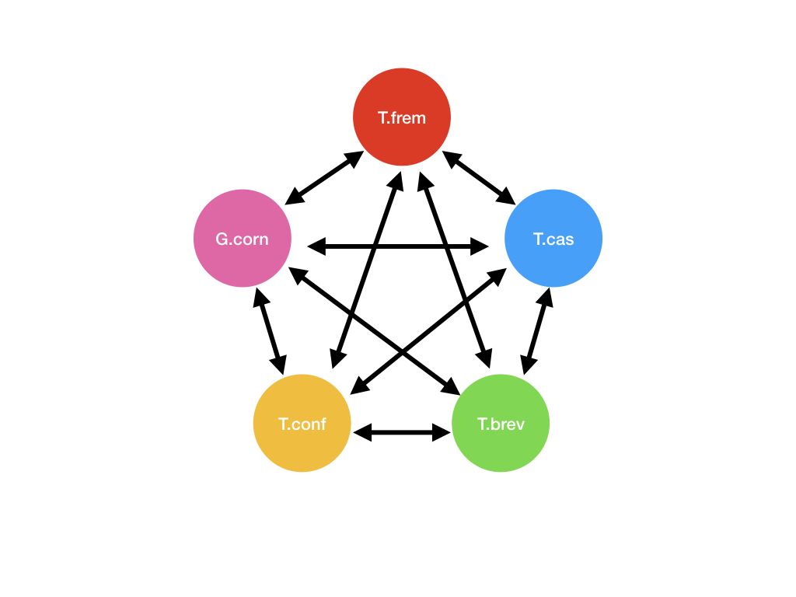

### Group 4

|Step |Program|Flags/Filter/Parameters| Notes|
|-----|:-----:|:------------:|--------:|
|1.b |BUSCO||This creates short_summary.txt. >>> Tip: Run generate_plot to create a graph of the summary. <<<|
|2.a|TransDecoder.LongOrfs| > 100bp |This creates 4 files. A `cds` file, a `pep` file, a `gff` file and a `bed` file.|
|2.b|BLASTP|-max_target_seqs 1, -outfmt 6, -evalue 1e-10| This gives the homologous sequences between _T. castaneum_ and the target species|
|2.c|TransDecoder.Predict| --retain_blastp_hits blastp.outfmt6 |This creates 4 files. A `cds` file, a `pep` file, a `gff` file and a `bed` file.|
|2.d|BUSCO||This creates short_summary.txt. >>> Tip: Run generate_plot to create a graph of the summary. <<<|
|3.a|BLASTP|-max_target_seqs 1, -outfmt 6|This would create 20 files.(5P2)|
|3.b|RBBH - python script|pull out the reciprocal best hits only.| This would create 10 files.|
|3.c|Orthologs - python script|pull out the orthologs among 5 species|This would create 1 file and let us call this the orthologs file._>> Note: The order in which you process the Best Hits file would affect the final number of orthologs.<<_|
|4.a|Annotation|use gff file|Add annotation to the orthologs file.|
