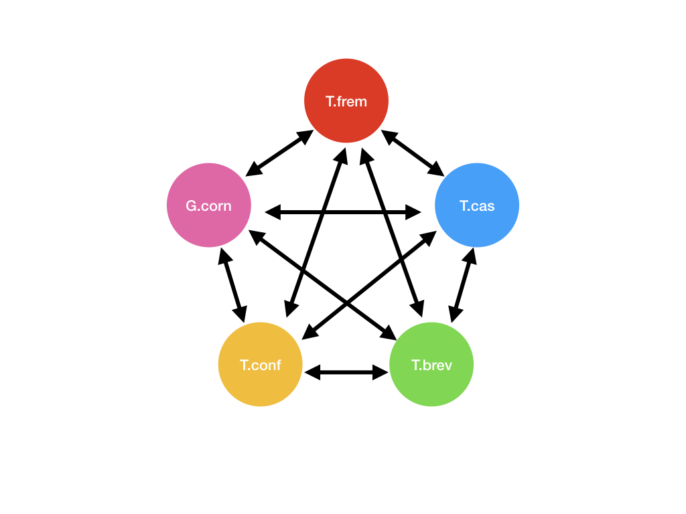

### Group 5

|Step |Program|Flags/Filter/Parameters| Notes|
|-----|:-----:|:------------:|--------:|
|1.b |BUSCO||This creates short_summary.txt. >>> Tip: Run generate_plot to create a graph of the summary. <<<|
|2.a|salmon|use --gcBias, --seqBias and --validateMappings|Output directory has `quant.sf` file.|
|2.b|python script| Highest Isoform for each gene |1. Apply this filter to the quant.sf file and collect the transcript ids. 2.Then get the sequences of the collected transcripts from the fasta file.|
|2.c|BUSCO||This creates short_summary.txt. >>> Tip: Run generate_plot to create a graph of the summary. <<<|
|3.1.a|cd-hit-est|-c 0.95|This clusters 95% similar transcript sequences together in the transcriptome file and creates a non-redundant sequence file|
|3.1.b|BUSCO||This creates short_summary.txt. >>> Tip: Run generate_plot to create a graph of the summary. <<<|
|3.2.a|TransDecoder.LongOrfs| > 200bp |This creates 4 files. A `cds` file, a `pep` file, a `gff` file and a `bed` file.|
|3.2.b|BLASTP|-max_target_seqs 1, -outfmt 6, -evalue 1e-5| This gives the homologous sequences between _T. castaneum_ and the target species|
|3.2.c|TransDecoder.Predict| --retain_blastp_hits blastp.outfmt6 |This creates 4 files. A `cds` file, a `pep` file, a `gff` file and a `bed` file.|
|3.2.d|BUSCO||This creates short_summary.txt. >>> Tip: Run generate_plot to create a graph of the summary. <<<|
|4.a|BLASTP|-max_target_seqs 1, -outfmt 6|This would create 20 files. 5P2|
|4.b|RBBH - python script|pull out the reciprocal best hits only.| This would create 10 files.|
|4.c|Orthologs - python script|pull out the orthologs among 5 species|This would create 1 file and let us call this the orthologs file._>> Note: The order in which you process the Best Hits file would affect the final number of orthologs.<<_|
|5.a|Annotation|use gff file|Add annotation to the orthologs file.|
