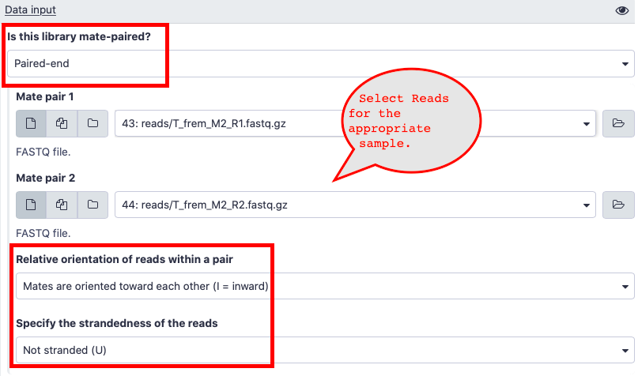

> Coming together is beginning; keeping together is progress; working together is success.

### Project Objective:

> Find the orthologs among the 5 species of beetles and annotate the orthologs.Â

### Project Workflow:
__Step 1:__ Construct a _de novo_ transcriptome assembly.  
	~~a. Run Trinity to construct a primary assembly.~~  
	b. Run BUSCO to check the quality of the assembly. Use `BUSCO`  
__Step 2:__ Filter transcripts with low expression.  
	a. Quantify the expression for each gene. Use `salmon` in galaxy.  
* You can import the following galaxy history provided here. - [Galaxy History](https://usegalaxy.org/u/rameshb/h/bioinformatics-fall2019)  
* This history has all the reads and the four _de novo_ trinity assembly required to run salmon.  
* Salmon is available as a tool in Galaxy. - [Salmon in Galaxy](https://usegalaxy.org/root?tool_id=toolshed.g2.bx.psu.edu/repos/bgruening/salmon/salmon/0.14.1.2)  
- Here are answers to some of the questions about the input data in salmon.  
	- Is this library mate-paired? = Paired-end  
	- Relative orientation of reads within a pair  = Mates are oriented towards each other(I = inward)  
	- Specify the strandedness of the reads
	Not stranded (U) = Not Stranded (U)  
	  
	- Please choose `Yes` for gcBias and sequence-specific Bias when you run salmon.  
	  

b. Retain only the highest expressed isoforms for each gene. Write a `python` script.  
c. Run BUSCO to check the quality of the filtered transcriptome. Use `BUSCO`.  

__Step 3.1:__ Cluster identical sequences together.  
	a. Cluster all the sequences which are 95% identical within the transcriptome file. Use `cd-hit-est` with `-c 0.95` flag.  
	b. Run BUSCO to check the quality of the filtered transcriptome. Use `BUSCO`.  

__Step 3.2:__ Identify the coding regions.  
a. Using generated transcriptome from the previous step, run LongOrfs with threshold set to at least 200 aa length for each ORF. Use `TransDecoder.LongOrfs`  
b. Using the predicted peptide sequences (`.pep` file) run BLASTP against _Tribolium castaneum_ protein sequences. Use `makeblastdb` and `blastp` with `-max_target_seqs 1 -outfmt 6 -evalue 1e-5` flags.

```bash
# Get the sequence file.
wget ftp://ftp.ncbi.nlm.nih.gov/genomes/all/GCF/000/002/335/GCF_000002335.3_Tcas5.2/GCF_000002335.3_Tcas5.2_protein.faa.gz
# Uncompress the file.
gzip -d GCF_000002335.3_Tcas5.2_protein.faa.gz
# Make sure to create blastdb before this command.
# Example blastp
blastp -query transdecoder_dir/longest_orfs.pep -db Tcas_protein_db.fasta  -max_target_seqs 1 -outfmt 6 -evalue 1e-5 -num_threads 48 > blastp.outfmt6
```
c. Using the homology information from BLASTP, predict the coding sequence.
```bash
TransDecoder.Predict -t target_transcripts.fasta --retain_blastp_hits blastp.outfmt6
```
d. Run BUSCO to check the quality of the filtered transcriptome. Use `BUSCO`  

__Step 4:__ Find the Orthologs among 5 species.  
	a. Run all vs all BLAST among 5 species. Use `makeblastdb` and `blastp`.  
	b. Pick the reciprocal Best BLAST hit (RBBH). Write a `python` script.  
	c. Run a 5 way script to pull out the orthologs among 5 species. Write a `python` script.  

__Step 5:__ Add annotation to the orthologs.  
 	a. Add annotation to the orthologs. Using T_cas ids and T_cas reference gff files, add chromosome id (for example: LGX, LG2 etc.),chromosome name (Autosome/ Sex chromosome). Write `python` script.  
```bash
# Get the gff file.
wget ftp://ftp.ncbi.nlm.nih.gov/genomes/all/GCF/000/002/335/GCF_000002335.3_Tcas5.2/GCF_000002335.3_Tcas5.2_genomic.gff.gz
# Uncompress the file.
gzip -d GCF_000002335.3_Tcas5.2_genomic.gff.gz
```

### Helpful Hints:

- To use BUSCO, the first step is to get the lineage and then busco can be run as follows.

	```bash
	# Get the lineage
	wget https://busco.ezlab.org/datasets/endopterygota_odb9.tar.gz
	# Uncompress the directory.
	tar xvf endopterygota_odb9.tar.gz --gunzip
	# Activate busco environment
	conda activate busco
	# Run BUSCO
	run_busco --in transcriptome.fasta --out [output_directory_name] -l [path_to_]endopterygota_odb9 -m tran -c 48
	```
	- [BUSCO manual](http://gitlab.com/ezlab/busco/raw/master/BUSCO_v3_userguide.pdf)
- To use salmon, activate the conda environment and salmon can be run as follows.
	```bash
	# Activate salmon environment.
	conda activate salmon
	# Create an index for the transcriptome.
	salmon index -t transcriptome.fasta -i transcriptome_index
	# Quantify the expression.
	salmon quant -i transcriptome_index -l IU --seqBias --gcBias -1 Sample1_R1.fastq.gz -2 Sample1_R2.fastq.gz -p 48 --validateMappings -o Sample1
	```
	- [Salmon manual](https://salmon.readthedocs.io/en/latest/)
- TransDecoder has two programs. These two programs can be run as follows.
	```bash
	# To run LongOrfs with minimum ORF length as 200 amino acids.
	TransDecoder.LongOrfs -t target_transcripts.fasta -m 200
	# To run Predict
	TransDecoder.Predict -t target_transcripts.fasta --retain_blastp_hits blastp.outfmt6
	```
	- [TransDecoder manual](https://github.com/TransDecoder/TransDecoder/wiki)
- cd-hit-est can be run as follows.
	```bash
	cd-hit-est -i cds_file -o nr95_cds_file -c 0.95
	```
	- [cd-hit manual](https://github.com/weizhongli/cdhit/wiki/3.-User's-Guide#CDHITEST)

### Reference:

_De Novo_ transcriptome Assembly and Functional Annotation in Five species of Bats. - [PDF](../data/Santillan_et_al_2018.pdf)
