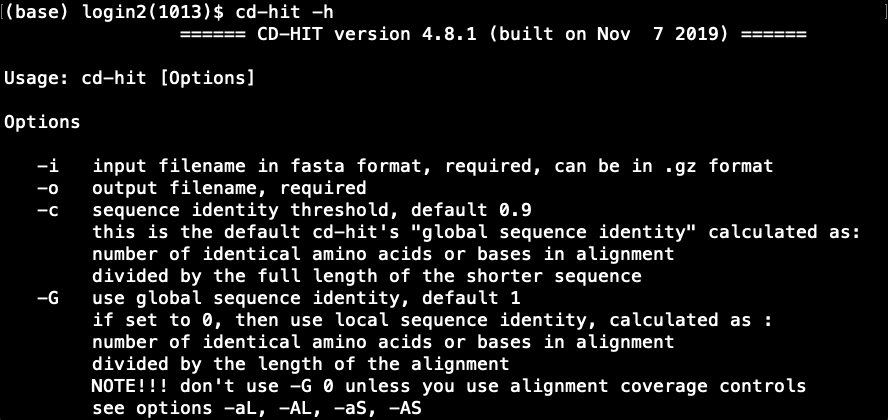
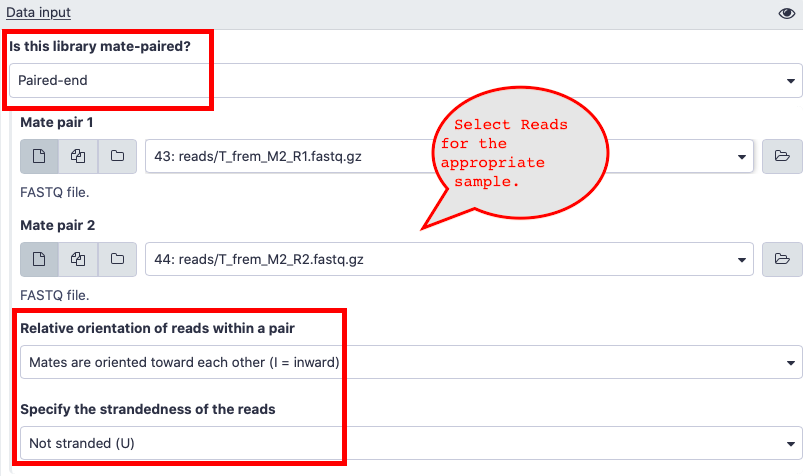
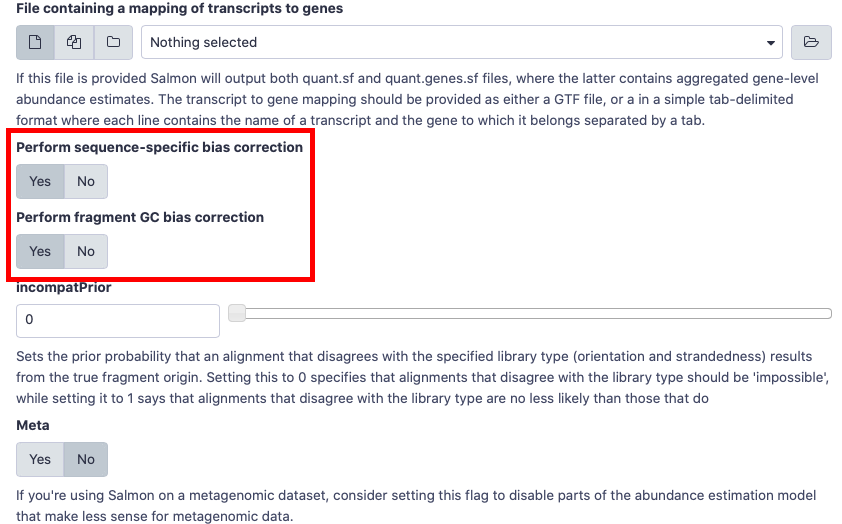
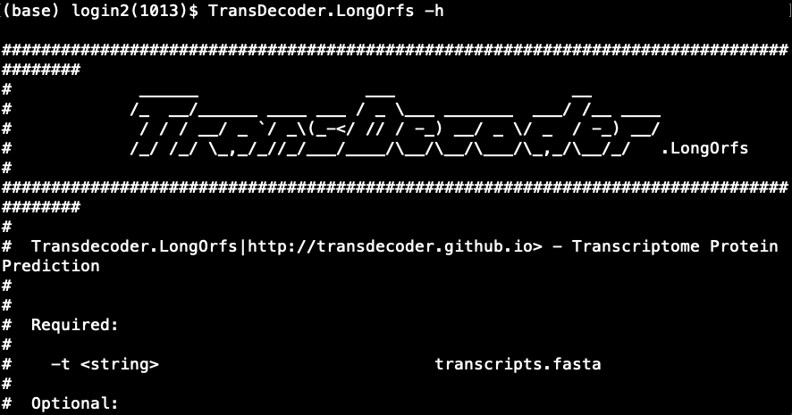

### Course Information:
This course provides an introduction to bioinformatics and computational genomics. The course is geared toward the student with a biology background and limited programming experience. Coursework will be completed almost exclusively in the UNIX/Linux computing environment and students will learn to program using Python. Students will learn: how to reframe biological problems into computationally tractable questions, basic computational biology algorithms, analyses of genome and transcriptome data.

### Project Objective:

> Find the orthologs among the 5 species of beetles and annotate the orthologs.

### Background Information:

<video width="1080" height="720" controls>
  <source src="data/Transcriptomics.MP4" type="video/mp4">
  <source src="data/Transcriptomics.MP4" type="video/mp4">
  Your browser does not support the video tag.
</video>

### Instructions:


|Group|Members|Instructions| Quick Guide|
|-----|:-----:|:------------:|--------:|
|1. | p1,q1,r1,s1,t1|[Group1](group1)|[Link](group1/guide)|
|2. | p2,q2,r2,s2,t2|[Group2](group2)|[Link](group2/guide)|
|3. | p3,q3,r3,s3,t3|[Group3](group3)|[Link](group3/guide)|
|4. | p4,q4,r4,s4,t4|[Group4](group4)|[Link](group4/guide)|
|5. | p5,q5,r5,s5,t5|[Group5](group5)|[Link](group5/guide)|

Your project depends on some of the following softwares/programs to carry out a specific task. Installation instructions are given below.

### Dependencies:
- Sequence Reads
	- It is a good practice to have all your reads in one directory.
	- You can copy the sequence reads to your working directory using `cp` command or globus file transfer.
	- The sequence reads are available in the following path.
	```bash
	/work/01248/jpdemuth/stampede2/5340_share/reads
	```
- Trinity Assembly
	- It is a good practice to have all your Trinity assemblies in one directory.
	- You can copy the assembly files to your working directory using `cp` command or globus file transfer.
	- The assemblies are available in the following path.
	```bash
	/work/01248/jpdemuth/stampede2/5340_share/trinity_assembly
	```

- [Conda](https://docs.conda.io/en/latest/miniconda.html)  
	1. What is `conda`?
		- Conda is an open source package and environment manager for python and other languages. It helps installing packages and its dependencies easier. It is also useful in downgrading or upgrading to different versions of the same package.  
	2. How to get and install `conda`?
		- Choose 64-bit Linux Installers for Python 3.7

		```bash
		# Navigate to home directory
		cd ~
		# Get the installer.
		wget https://repo.anaconda.com/miniconda/Miniconda3-latest-Linux-x86_64.sh
		# Run the installer.
		bash Miniconda3-latest-Linux-x86_64.sh
		```
		- _Note_: Type "yes" to the following warning during installation.
		>WARNING:You currently have a PYTHONPATH environment variable set. This may cause unexpected behavior when running the Python interpreter in Miniconda3. For best results, please verify that your PYTHONPATH only points to directories of packages that are compatible with the Python interpreter in Miniconda3: /home1/01248/[username]/miniconda3  

		- _Note_: Type "yes" to initialize Miniconda3.
	3. How to check if `conda` is active?
		- If `conda` is active you will see `(base)` at the beginning of the shell prompt as shown below.
		
		- If conda is not active you can activate by sourcing the `.bashrc` file from your home directory as follows.
			```bash
			# Activate conda by using source
			source ~/.bashrc
			```

- [BUSCO](https://busco.ezlab.org)
	1. What is `busco`?
		- BUSCO stands for **B**enchmarking **U**niversal **S**ingle-**C**opy **O**rthologs. BUSCO is primarily used to analyze the completeness of a genome, a transcriptome or a gene set by using highly conserved orthologs for a given lineage.
	2. How to get and install `busco`?
		- Install busco using conda as follows.
			- `conda create -n busco -c bioconda busco`
			- Type `yes` or `y` to install all dependencies.
		- This installs BUSCO but unfortunately, the configuration file isn't setup. To setup the configuration file,
			- `cd` to `miniconda3/envs/busco/config/` directory.
			- `wget https://rameshbalan.github.io/bioinfo/data/config.ini`.

	3. How to check if `busco` is installed properly?
		```bash
	# cd to home directory
	cd ~
	# Get the lineage
	wget https://busco.ezlab.org/datasets/endopterygota_odb9.tar.gz
	# Uncompress the directory.
	tar xvf endopterygota_odb9.tar.gz --gunzip
	# Activate busco environment
	conda activate busco
	# Run BUSCO
	run_busco --in [name_of_]trinity_assembly.fasta --out [output_directory_name] -l [path_to_]endopterygota_odb9 -m tran
		```
		- If you get an error, please ask for assistance.
	4. To run `busco` from an `sbatch` script it is necessary to source the `.bashrc` file and to activate busco environment. Here is a sample [sbatch script](data/sample_busco_sbatch.sh).  
		- You can view the sbatch file here : [Link](https://raw.githubusercontent.com/rameshbalan/bioinfo/master/data/sample_busco_sbatch.sh)
		- If you were to use the sample busco sbatch script, please make sure to _change your email id_ in the script.
		> Note: `busco` takes more than 12 hours to complete on a knl node. However, it takes less than 30 minutes on a skylake node. The above `sbatch` script is for a skylake node.

- [cd-hit](http://weizhongli-lab.org/cd-hit/)
	1. What is `cd-hit`?
		- `cd-hit` (`cd-hit-est`) is a clustering program for protein (nucleotide) sequences to reduce sequence redundancy.
	2. How to get and install `cd-hit`?
		- Navigate to your home directory using `cd ~` and install as follows.  
	```bash
	# Get the installer.
	wget https://github.com/weizhongli/cdhit/releases/download/V4.8.1/cd-hit-v4.8.1-2019-0228.tar.gz
	# Uncompress the package.
	tar xvf cd-hit-v4.8.1-2019-0228.tar.gz --gunzip
	# Navigate to the directory and build the programs.
	cd cd-hit-v4.8.1-2019-0228
	make
	```
	3. How to add `cd-hit` to the path variable?  
		```bash
	# Open .bashrc file
	nano ~/.bashrc
	# Add the path
	export PATH=$PATH:~/cd-hit-v4.8.1-2019-0228
		```
	4. How to check if `cd-hit` is installed properly?
		```bash
	# Source the .bashrc
	source ~/.bashrc
	# Try
	cd-hit -h
		```
		- This will print the usage and various options available in `cd-hit` as shown below.
		  
		- If you get an error, please ask for assistance.
- [salmon](https://combine-lab.github.io/salmon/)
	1. What is `salmon`?
		- `salmon` is an alignment free mapping tool to quantify the expression of transcripts. It is extremely fast and has several useful in-built flags such as `--gcBias` and `--seqBias` which models the bias in the sample and corrects for it.
		- Install salmon using conda as follows.
			- `conda create -n salmon -c bioconda salmon`
		- To use salmon in `idev` mode
			- `conda activate salmon`
		- To use salmon in `sbatch` script, please source the `.bashrc` file and activate salmon.
		```bash
		# Source bashrc
		source ~/.bashrc
		# Activate salmon
		conda activate salmon
		```
	2. What do I do if I get a `salmon: error while loading shared libraries: libboost_iostreams.so.1.60.0:` error?
		- We could use salmon in galaxy. Here are the instructions.
		- You can import the following galaxy history provided here. - [Galaxy History](https://usegalaxy.org/u/rameshb/h/bioinformatics-fall2019)  
			- This history has all the reads and the four _de novo_ trinity assembly required to run salmon.  
			- You may have to add T_cas reference transcriptome to your history. Here is the link.  - [T_cas Transcriptome](ftp://ftp.ncbi.nlm.nih.gov/genomes/all/GCF/000/002/335/GCF_000002335.3_Tcas5.2/GCF_000002335.3_Tcas5.2_rna.fna.gz)
		- Salmon is available as a tool in Galaxy. - [Salmon in Galaxy](https://usegalaxy.org/root?tool_id=toolshed.g2.bx.psu.edu/repos/bgruening/salmon/salmon/0.14.1.2)  
			- Here are answers to some of the questions about the input data in salmon.
				- Is this library mate-paired?  
					- Paired-end  
				- Relative orientation of reads within a pair  
					- Mates are oriented towards each other(I = inward)  
				- Specify the strandedness of the reads
Not stranded (U)  
					- Not Stranded (U)
				
				- Please choose `Yes` for gcBias and sequence-specific Bias when you run salmon.  
				

	3. What do I do if I get a `bad_alloc()` error?  
		- This will happen if you are in group 1 or group 5.
		- We think this error has to do with the memory allocation on Stampede2 when salmon is called. One of the workaround, is to use `trinity` by calling `salmon` in a script. The instructions are as follows.
			- Install `trinity`  
			```bash
			# Navigate to home directory
			cd ~
			# Getting Trinity
			wget https://github.com/trinityrnaseq/trinityrnaseq/releases/download/v2.8.6/trinityrnaseq-v2.8.6.FULL.tar.gz
			# Uncompressing Trinity
			tar xvf trinityrnaseq-v2.8.6.FULL.tar.gz
			# Installing trinity
			cd trinityrnaseq-v2.8.6
			make
			make plugins
			```
			- Dependencies.
			```bash
			module load intel/17.0.4
			module load samtools
			conda activate salmon
			```
			- We can either add `trinityrnaseq-v2.8.6/util` to the `$PATH` or we could type the path to the script.
			- Using `align_and_estimate_abundance.pl` script in `trinityrnaseq-v2.8.6/util` directory, we can estimate expression as follows.
			```bash
			# Estimating Expression
align_and_estimate_abundance.pl --transcripts T_frem.fasta --seqType fq --left reads/T_frem_M1_R1.fastq.gz --right reads/T_frem_M1_R2.fastq.gz --est_method salmon --output_dir T_frem_M1 --prep_reference
			```
		- Here is a sample sbatch script to run salmon. - [Link](data/sample_salmon_sbatch.sh)  
			- Please change the email id and other parameters for the `align_and_estimate_abundance.pl` to reflect the sample that you want to quantify in the example sbatch script.
		- Feel free to ask for assistance.

- [TransDecoder](https://github.com/TransDecoder/TransDecoder/wiki)
	1. What is `TransDecoder`?
		- Coding regions within the transcript sequences can be identified by using `TransDecoder`. It has two major steps. The first step identifies the Open Reading Frames (ORFs) and then it predicts the likely coding regions.
	2. How to get and install `TransDecoder`?
	```bash
	# Navigate to the home directory
	cd ~
	# Get the package.
	wget https://github.com/TransDecoder/TransDecoder/archive/TransDecoder-v5.5.0.tar.gz
	# Uncompress the package.
	tar xvf TransDecoder-v5.5.0.tar.gz --gunzip
	```
	3. Add TransDecoder to the path variable in bashrc.
		```bash
	# Open .bashrc file
	nano ~/.bashrc
	# Add the path
	export PATH=$PATH:~/TransDecoder-TransDecoder-v5.5.0
		```
	4. How to check if TransDecoder is installed properly?
		```bash
	# Source the .bashrc
	source ~/.bashrc
	# Try
	TransDecoder.LongOrfs -h
		```
		- This will print the usage and various options available in `TransDecoder.LongOrfs` as shown below.
		  
		- `TransDecoder.Predict` is in the same directory as `TransDecoder.LongOrfs` and you can test it by using `TransDecoder.Predict -h`
		- If you get an error, please ask for assistance.
- [python3](https://www.python.org)
	- This should be available via conda and also as a module in Stampede2.
	- Try `python3` in the terminal. If you get an error, try `module load python3`.
- [BLAST](https://www.ncbi.nlm.nih.gov/books/NBK279690/)
	- This should be available as a module in Stampede2 and also in `busco` environment.
	- Try `module load blast` or `conda activate busco` followed by `blastp`.
